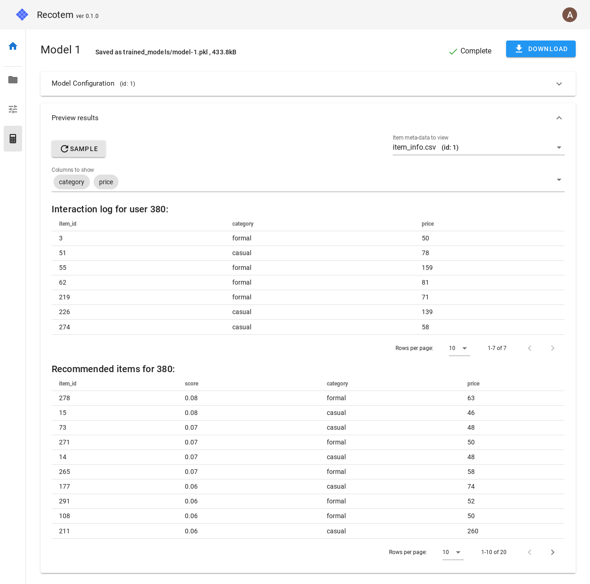

# Recotem

## Overview

Recotem is an easy to use interface to recommender systems;
Recotem can be launched on any platform with Docker.
It ships with a Web-base UI, and you can train and (qualitatively) evaluate the recommendation engine solely using UI.

Recotem is licensed under Apache 2.0

## Getting Started

## Development
